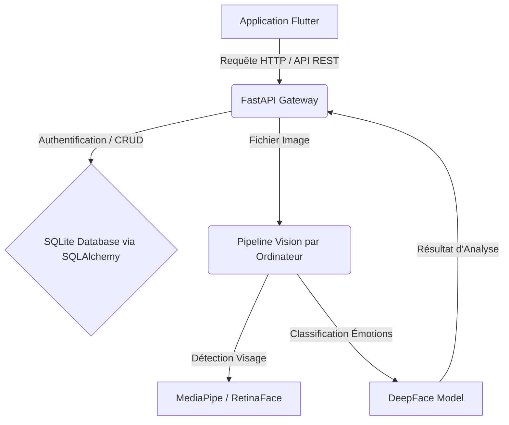

# Rapport de Synthèse Technique : Backend MoodFace AI

Ce document présente une vue d'ensemble de l'architecture, des technologies utilisées et du fonctionnement de l'API backend de l'application **MoodFace AI**. Ce rapport est structuré de manière à être directement transmissible à un encadrant ou un jury académique.

---

## 1. Vue d'Ensemble du Système

Le backend de **MoodFace AI** a pour objectif principal d'assurer la gestion des utilisateurs (authentification, inscription), de fournir un pipeline d'analyse d'émotions en temps réel par vision par ordinateur et de conserver un historique sécurisé des analyses pour chaque utilisateur.

---

## 2. Architecture Logicielle & Technologies

Le service s'appuie sur une stack technologique robuste en **Python**, favorisant la rapidité d'exécution et l'intégration de bibliothèques d'intelligence artificielle :

*   **FastAPI** : Framework web asynchrone moderne et performant, utilisé pour concevoir l'API REST. Il génère automatiquement la documentation interactive (Swagger UI disponible sur `/docs`).
*   **SQLAlchemy** : ORM (Object-Relational Mapping) facilitant l'abstraction et la manipulation de la base de données sous forme d'objets Python.
*   **SQLite** : Système de gestion de base de données relationnelle léger et autonome, adapté au projet.
*   **DeepFace & RetinaFace** : Framework d'apprentissage profond de pointe pour la reconnaissance faciale et l'analyse d'attributs (émotions).
*   **MediaPipe & OpenCV** : Bibliothèques pour le chargement, le prétraitement des images et la détection optimisée des visages.

---

## 3. Structure du Projet

L'architecture du code respecte le design pattern MVC/clean-architecture pour découpler les responsabilités :

*   [`main.py`](file:///C:/Users/Lenovo/moodface-backend/main.py) : Point d'entrée de l'application. Initialise les tables, configure les règles de CORS pour la communication externe et définit les routes/endpoints de l'API.
*   [`database.py`](file:///C:/Users/Lenovo/moodface-backend/database.py) : Configure le moteur de base de données SQLite et gère le cycle de vie des sessions de connexion.
*   [`models.py`](file:///C:/Users/Lenovo/moodface-backend/models.py) : Définit les schémas de table physique (structure relationnelle SQL) :
    *   `users` : identifiants, nom, email et mot de passe sécurisé.
    *   `emotion_records` : liaison ForeignKey avec l'utilisateur, libellé de l'émotion détectée, score de confiance et timestamp de création.
*   [`schemas.py`](file:///C:/Users/Lenovo/moodface-backend/schemas.py) : Modèles de validation de données (Pydantic) pour s'assurer que les entrées/sorties de l'API respectent le format attendu.
*   [`crud.py`](file:///C:/Users/Lenovo/moodface-backend/crud.py) : Regroupe les opérations d'accès aux données (Create, Read, Update, Delete) et intègre le protocole de hachage de mot de passe.
*   [`analyzer.py`](file:///C:/Users/Lenovo/moodface-backend/analyzer.py) : Contient l'algorithme d'analyse d'image et le pipeline IA.

---

## 4. Pipeline d'Analyse d'Émotions (Computer Vision)

Le module de vision par ordinateur est conçu pour être à la fois rapide et tolérant aux conditions réelles de prise de vue (luminosité, angle) :

1.  **Réception et Validation** : Le backend vérifie le format de l'image (JPG, PNG).
2.  **Détection de Visage (Multi-Backend)** : 
    *   Utilisation initiale de **MediaPipe Face Detection** (sélectionné pour sa rapidité sur les selfies).
    *   En cas d'échec, le pipeline bascule sur le détecteur **RetinaFace** intégré à DeepFace, qui est extrêmement robuste pour localiser les visages même de profil ou partiellement masqués.
3.  **Classification & Prédiction** : Les modèles de DeepFace classifient les expressions parmi 7 émotions : *Joie/Heureux, Triste, Neutre, Colère, Surprise, Peur, Dégoût*.
4.  **Calibration de l'émotion dominante** : Pour éviter que le modèle ne renvoie une émotion neutre par défaut alors qu'une micro-expression active est décelée, l'algorithme privilégie les émotions actives si leur score de confiance dépasse un seuil calibré de $20\%$.

---

## 5. Endpoints de l'API (Routes REST)

L'API expose quatre points d'accès majeurs documentés et sécurisés :

### Inscription d'utilisateur
*   **Route** : `POST /register`
*   **Rôle** : Reçoit le nom, l'email et le mot de passe. Hache le mot de passe via l'algorithme standard **PBKDF2-HMAC (SHA-256)** salé, et crée le compte en base de données.

### Connexion / Authentification
*   **Route** : `POST /login`
*   **Rôle** : Vérifie la correspondance des identifiants et renvoie les informations de l'utilisateur (ID, Nom, Email) pour stockage côté client (DataStore).

### Analyse de l'état émotionnel
*   **Route** : `POST /predict`
*   **Rôle** : Reçoit l'image capturée par la caméra du téléphone mobile, exécute le pipeline IA et retourne l'émotion dominante avec sa confiance numérique. Si un `user_id` valide est inclus dans la requête, le résultat est automatiquement stocké dans l'historique de l'utilisateur.

### Historique des analyses
*   **Route** : `GET /history/{user_id}`
*   **Rôle** : Récupère la liste chronologique décroissante des dernières analyses effectuées par l'utilisateur ciblé.

---

## 6. Avantages Clés du Backend

> [!NOTE]
> **Performance Asynchrone** : FastAPI permet de traiter de multiples requêtes d'analyse d'images simultanément sans bloquer le serveur.

> [!TIP]
> **Sécurité Intégrée** : Aucun mot de passe n'est stocké en clair grâce à l'algorithme de hachage de la bibliothèque standard, ce qui limite les failles de sécurité.

> [!IMPORTANT]
> **Résilience du Pipeline IA** : L'utilisation conjointe de MediaPipe et de RetinaFace assure un excellent taux de détection dans des conditions d'utilisation réelles (lumière tamisée, inclinaison de la tête).
